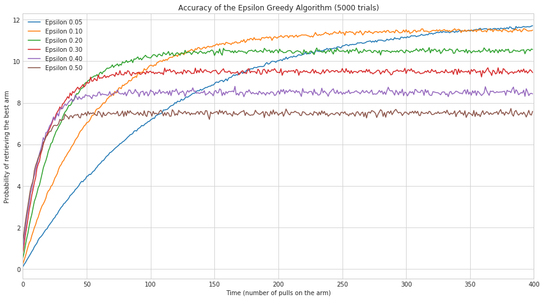
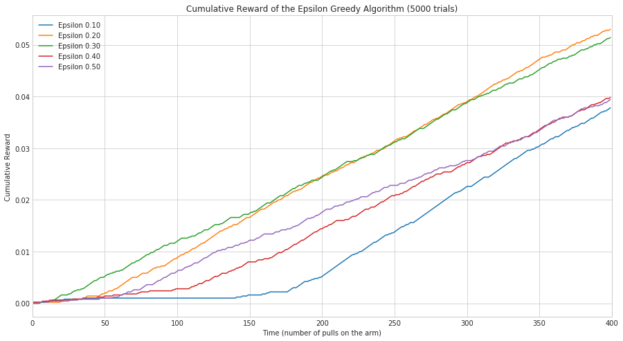

.. title: Finding the Best Epsilon
.. slug: finding-the-best-epsilon
   .. date: 2017-07-30 18:41:00
.. tags: algorithm
.. link: 
.. description: Examining the epsilon-greedy outcomes.
.. type: text
.. author: hades

.. contents::

1 Introduction
--------------

This is one of the ways to characterize the performance of the *Epsilon Greedy* agent using our *Bernoulli Arm*. We are going to look at three ways to evaluate how well the algorithm does.

- probability of using the best arm

- average reward

- cumulative reward

2 Imports
---------

.. code:: ipython

    # python standard library
    import random
    from datetime import datetime

    # pypi
    from numba import jit
    import numpy
    import pandas
    import matplotlib.pyplot as plot
    import seaborn

    # this project
    from epsilon_greedy import (
        EpsilonGreedy,
        find_first
    )
    from epsilon_greedy_optimized import EpsilonGreedyOptimized
    from bernoulli_arm import BernoulliArm

3 Set-up the Plotting
---------------------

This will enable the plotting and set the style.

.. code:: ipython

    %matplotlib inline
    seaborn.set_style("whitegrid")

4 The Probabilities
-------------------

4.1 Generate the Probabilities
~~~~~~~~~~~~~~~~~~~~~~~~~~~~~~

This code will run generate the probabilities. Although I made it so that using the ``EpsilonGreedy`` call method would both choose the arm and update the reward, in this case we need to know which arm was selected so I'm going to do the steps individually.

.. code:: ipython

    def generate_probabilities(times=1000, trials=100):
        """this generates the probabilites for finding the best arm

        Args:
         trials (int): number of times to train the agent
         times (int): length of time to train the agent
        Returns:
         Dict: the probabilites for each epsilon over time
         """
        arm_probabilities = [0.1, 0.1, 0.1, 0.9, 0.1]
        random.shuffle(arm_probabilities)
        best_arm = arm_probabilities.index(max(arm_probabilities))
        arms = [BernoulliArm(probability) for probability in arm_probabilities]
        epsilons = numpy.array([0.05, 0.1, 0.2, 0.3, 0.4, 0.5])

        outcomes = {}
        for epsilon in epsilons:
            agent = EpsilonGreedy(epsilon, arms)
            probabilities = numpy.zeros(times)
            for trial in range(trials):
                for time in range(times):
                    arm = agent.select_arm()
                    agent.update(arm)
                    if arm == best_arm:
                        probabilities[time] += 1
                agent.reset()
            outcomes["Epsilon {:.02f}".format(epsilon)] = probabilities/times
        return outcomes

4.2 Inspecting the Outcome
~~~~~~~~~~~~~~~~~~~~~~~~~~

.. code:: ipython

    TRIALS = 5000
    TIMES = 400

.. code:: ipython

    start = datetime.now()
    probabilities = generate_probabilities(trials=TRIALS, times=TIMES)
    print("Run Time: {0}".format(datetime.now() - start))
    probabilities = pandas.DataFrame.from_dict(probabilities)
    probabilities.describe()

::

           Epsilon 0.05  Epsilon 0.10  Epsilon 0.20  Epsilon 0.30  Epsilon 0.40  \
    count    400.000000    400.000000    400.000000    400.000000    400.000000   
    mean       8.784956      9.971200      9.801344      9.084844      8.235194   
    std        3.064916      2.523568      1.775677      1.319447      0.998305   
    min        0.120000      0.275000      0.495000      0.757500      1.050000   
    25%        7.141875      9.740000     10.264375      9.390000      8.409375   
    50%        9.937500     11.187500     10.456250      9.475000      8.480000   
    75%       11.225000     11.457500     10.515000      9.530625      8.545000   
    max       11.720000     11.605000     10.727500      9.665000      8.712500   

           Epsilon 0.50  
    count    400.000000  
    mean       7.310087  
    std        0.763259  
    min        1.190000  
    25%        7.406875  
    50%        7.473750  
    75%        7.535625  
    max        7.725000  

.. code:: ipython

    probabilities.to_csv("epsilon_greedy_accuracy.csv")

.. code:: ipython

    figure = plot.figure(figsize=(10, 6))
    axe = figure.gca()
    axe.set_title("Accuracy of the Epsilon Greedy Algorithm ({} trials)".format(TRIALS))
    axe.set_xlabel("Time (number of pulls on the arm)")
    axe.set_ylabel("Probability of retrieving the best arm")
    probabilities.plot(ax=axe)

Looking at the plots, it appears that the epsilons greater than 0.05 converge faster that 0.05 (their curves are steeper at the beginning), as you would expect, but they also don't do as well in the long run, as you might also expect, since they're doing more exploration. In the long run, the more exploitation, the better the profit, but I suppose it depends on the window you have to work with, if you have a short one, then the more aggresive explorers might be better. Anything less than 350 would do better with 0.1 rather than 0.05, for instance.

5 Average Reward
----------------

One of the things to note about the previous trials is that there was one arm that did notably better than all the others. When they are more uniform using the probability of retrieving the best arm might not be as revealing. Instead, using the average reward so far would give us more information.

.. code:: ipython

    @jit
    def average_reward(times=1000, trials=100):
        """this generates the probabilites for finding the best arm

        Args:
         trials (int): number of times to train the agent
         times (int): length of time to train the agent
        Returns:
         Dict: the probabilites for each epsilon over time
        """
        arm_probabilities = numpy.array([0.1, 0.2, 0.3, 0.4, 0.5])
        random.shuffle(arm_probabilities)
        # arms = [BernoulliArm(probability) for probability in arm_probabilities]
        epsilons = numpy.array([0.1, 0.2, 0.3, 0.4, 0.5])

        outcomes = {}
        for epsilon in epsilons:
            agent = EpsilonGreedyOptimized(epsilon, arm_probabilities)
            average_rewards = numpy.zeros(times)
            for trial in range(trials):
                for time in range(times):
                    arm = agent.select_arm()
                    old_reward = agent.total_reward
                    agent.update(arm)
                    average_rewards[time] += (agent.total_reward - old_reward)
                agent.reset()
            outcomes["Epsilon {0:.02f}".format(epsilon)] = average_rewards/trials
        return outcomes

.. code:: ipython

    start = datetime.now()
    averages = average_reward(TIMES, TRIALS)
    print("Run Time: {0}".format(datetime.now() - start))
    averages = pandas.DataFrame.from_dict(averages)

::

    Run Time: 0:01:08.727723

.. code:: ipython

    figure = plot.figure(figsize=(10, 6))
    axe = figure.gca()
    axe.set_title("Reward of the Epsilon Greedy Algorithm ({} trials)".format(TRIALS))
    axe.set_xlabel("Time (number of pulls on the arm)")
    axe.set_ylabel("Average Reward")
    averages.plot(ax=axe, marker='.', linestyle="None")

.. image:: epsilon_averages.png

There's much more variablity and overlap here, as you might expect since I made the probabilities closer. Interestingly, the strongly exploratory agents seem to do worse, even from the beginning, while the more exploitative ones do better.  Although it looks like 0.2 might be doing as well or better than 0.1 once you get over 100.

6 Cumulative Reward
-------------------

The previous two metrics turn out to be useful, but somewhat unfair to the aggresively exploring models, which we know won't ultimately do as well, but do have an advantage in the initial phase. To better qualify the overall effect of exploration versus exploitation, it's better to use a cumulative sum of the rewards.

.. code:: ipython

    @jit
    def cumulative_reward(arms, times=1000, trials=100):
        """this generates the cumulative reward as the agent pulls the arms

        Args:
         arms (numpy.array): array of probabilities that the arm will pay-off
         trials (int): number of times to train the agent
         times (int): length of time to train the agent
        Returns:
         Dict: the probabilites for each epsilon over time
        """
        random.shuffle(arms)
        epsilons = numpy.array([0.1, 0.2, 0.3, 0.4, 0.5])

        outcomes = {}
        for epsilon in epsilons:
            agent = EpsilonGreedyOptimized(epsilon, arms)
            cumulative_rewards = numpy.zeros(times)
            for trial in range(trials):
                for time in range(times):
                    arm = agent.select_arm()
                    agent.update(arm)
                    cumulative_rewards[time] = agent.total_reward            
                agent.reset()
            outcomes["Epsilon {:.02f}".format(epsilon)] = cumulative_rewards/trials
        return outcomes

.. code:: ipython

    def generate_cumulative(arms):
        """runs the cumulative output function

        Args:
         arms (numpy.array): probabilities that arms will pay out

        Returns:
         pandas.DataFrame: the average cumulative rewards
        """
        start = datetime.now()
        cumulative = cumulative_reward(arms, times=TIMES, trials=TRIALS)
        print("Run Time: {0}".format(datetime.now() - start))
        return pandas.DataFrame.from_dict(cumulative)

.. code:: ipython

    def plot_cumulative(cumulative):
        """generates and plots cumulative average

        Args:
         cumulative (pandas.DataFrame): data to plot
        """
        figure = plot.figure(figsize=(10, 6))
        axe = figure.gca()
        axe.set_title("Cumulative Reward of the Epsilon Greedy Algorithm ({} trials)".format(TRIALS))
        axe.set_xlabel("Time (number of pulls on the arm)")
        axe.set_ylabel("Cumulative Reward")
        cumulative.plot(ax=axe)
        return

.. code:: ipython

    cumulative = generate_cumulative(numpy.arange(0.1, 0.6, 0.1))
    plot_cumulative(cumulative)

.. image:: epsilon_greedy_cumulative.png

Because of the randomness this will change everytime you run it, but we can see that in this case, the average cumulative reward was better for the 0.3 and 0.5 epsilon values than the more conservative values up until around 275, and the second most conservative case (0.2) actually did worse on average than the more exploratory cases did.

6.1 Imbalanced Case
~~~~~~~~~~~~~~~~~~~

I'll re-run this again with more arms and a only one clear good arm to see if this changes things.

.. code:: ipython

    plot_cumulative(generate_cumulative(numpy.array([0.1] * 10 + [0.9])))

In this case, the most exploitive agent did much worse than the other agents. It looks like it didn't find the best arm until around the 240th pull. In this case, when most arms pay off poorly and one arm pays off much better, the exploratory arms accumulate more reward within our time frame. I'm guessing that the 0.10 epsilon would, given enough time, pull ahead, and you can in fact see that the most exploratory agent has already been surpassed by the 0.2 agent, so eventually exploration would probably take a back seat to exploitation, but not in this case. It's important to note, however, that if the most exploitive agent had happened to find the best arm at the start, he would likely have ended up the best, it's just the nature of randomization that you aren't guaranteed that this would be the case.
